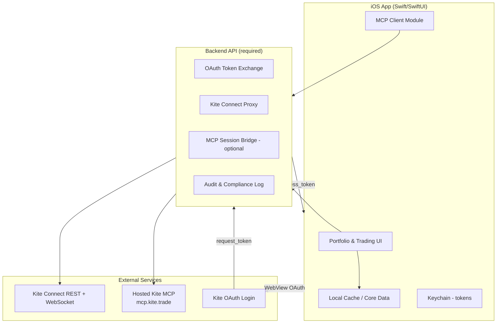
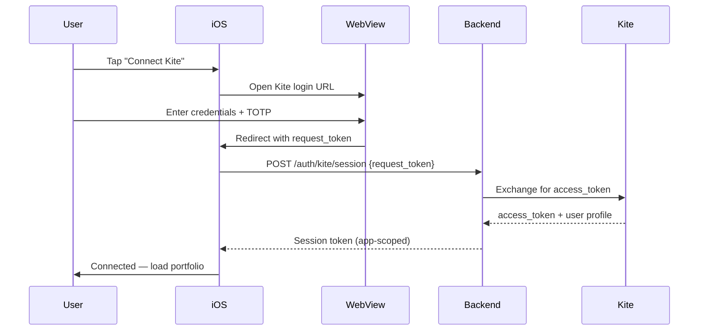

# Software Requirements Document (SRD)

## Unified Trade Account Manager — iOS Application

| Field | Value |
|---|---|
| **Document version** | 1.0 |
| **Date** | 6 August 2026 |
| **Author** | Software Architecture |
| **Status** | Draft for review |
| **Primary market** | India (SEBI-regulated equities, F&O) |
| **Initial broker integration** | Zerodha Kite |

---

## 1. Executive Summary

This document defines requirements for a native **iOS application** that lets a retail trader manage multiple trade accounts from a single place. **Phase 1** focuses on connecting a **Zerodha Kite** account in India and controlling an **equity portfolio** spanning **cash equities**, **futures**, and **options (F&O)**.

The app must support two integration modes:

1. **Kite Connect API** (primary) — authenticated trading, portfolio sync, order placement (buy/sell), and live market data.
2. **Kite MCP** (secondary / AI-assisted) — Model Context Protocol access to portfolio, positions, quotes, and (where permitted) order workflows via natural-language or agent-driven interactions.

The long-term vision is a **multi-broker command center**; Kite is the reference implementation and architectural template for future brokers.

---

## 2. Business Objectives

| Objective | Description |
|---|---|
| **Single pane of glass** | View holdings, positions, margins, P&L, and orders across connected accounts in one app. |
| **Actionable control** | Buy, sell, modify, and cancel orders for equities and F&O without switching apps. |
| **Low-friction onboarding** | Connect Kite using Zerodha’s standard OAuth + 2FA flow. |
| **AI-ready architecture** | Optional Kite MCP connection for portfolio intelligence, analysis, and assisted trading workflows. |
| **Extensibility** | Broker-agnostic domain model so additional Indian brokers can be added later. |

---

## 3. Scope

### 3.1 In Scope — Phase 1 (MVP)

- iOS native app (iPhone; iPad adaptive layout as stretch goal)
- Zerodha Kite account linking (one user, one Kite account initially)
- Portfolio views:
  - **Holdings** (delivery / long-term equity)
  - **Positions** (intraday equity, futures, options)
  - **Day vs net** position breakdown
- Order management:
  - Place buy/sell (MARKET, LIMIT, SL, SL-M)
  - Modify and cancel open orders
  - View today’s orders and trades
- Margin and funds summary
- Live quotes for watchlisted instruments (LTP, OHLC, volume)
- Kite MCP connection option for:
  - Pulling portfolio details and open positions
  - Viewing current holdings
  - Assisted buy/sell (subject to MCP capability and compliance gates; see §8)
- Secure session management, re-authentication, and disconnect/revoke

### 3.2 Out of Scope — Phase 1

- Android app
- Additional brokers (Groww, Upstox, ICICI, etc.) — planned Phase 2+
- Algorithmic / HFT strategies and colocation
- Mutual funds, commodities (MCX), currency (CDS/BCD) — optional Phase 1.5
- Tax reporting (P&L statements, capital gains)
- Social/copy trading
- In-app payment / wallet top-up (use Kite’s existing fund transfer flows)

### 3.3 Assumptions

- User has an **active Zerodha trading account** with **2FA TOTP** enabled.
- User will register a **Kite Connect developer app** (or use Zerodha-hosted MCP where API keys are not required).
- User accepts Zerodha API terms, session expiry rules (access tokens valid for the trading day), and any **static IP requirements** for order placement effective April 2026.
- User is an individual retail trader (not a registered investment advisor managing third-party funds).

---

## 4. Stakeholders & Personas

### 4.1 Primary Persona — Active Retail Trader (Rahul)

- Trades NSE/BSE equities and NFO derivatives
- Uses Kite today but wants a consolidated, customizable iOS experience
- Needs fast position visibility and one-tap exit actions
- Interested in AI-assisted portfolio Q&A via MCP

### 4.2 Secondary Persona — Swing Investor (Priya)

- Mostly delivery holdings, occasional F&O hedging
- Wants holdings P&L, corporate action awareness, and simple buy/sell
- Lower tolerance for complex order types

---

## 5. High-Level Architecture



### 5.1 Architecture Principles

| Principle | Rationale |
|---|---|
| **Never embed `api_secret` in the iOS app** | Kite Connect mandates server-side token exchange. |
| **Backend-first for trading** | Order placement, token refresh, and IP allowlisting must run on a trusted server. |
| **Offline-friendly reads** | Cache last-known portfolio; clearly mark stale data. |
| **Broker adapter pattern** | `BrokerConnector` interface with `KiteConnector` as first implementation. |
| **MCP as augmentation, not sole trading path** | Hosted MCP may be read-only or limited; Kite Connect remains the canonical execution path for buy/sell. |

### 5.2 Recommended Technology Stack

| Layer | Technology |
|---|---|
| iOS UI | SwiftUI, Combine/async-await |
| Local storage | SwiftData or Core Data; Keychain for secrets |
| Networking | URLSession + typed API client |
| Real-time quotes | Kite WebSocket (KiteTicker protocol) via backend relay or direct with access token |
| Backend | Node.js / Go / Python (FastAPI) — team preference; must support static egress IP |
| Auth | OAuth 2.0 style Kite login; PKCE where applicable |
| MCP | `@modelcontextprotocol/sdk` on backend; iOS talks to backend, not raw MCP stdio |
| Observability | Structured logs, crash reporting (Firebase Crashlytics or Sentry) |

---

## 6. Functional Requirements

Requirements use **MUST / SHOULD / MAY** per RFC 2119.

### 6.1 Account Connection (Kite)

| ID | Requirement | Priority |
|---|---|---|
| FR-ACC-01 | The app MUST allow the user to initiate Kite login via an in-app WebView pointing to `https://kite.zerodha.com/connect/login?api_key={api_key}`. | P0 |
| FR-ACC-02 | The app MUST capture `request_token` from the registered redirect URL and send it to the backend for `access_token` exchange. | P0 |
| FR-ACC-03 | The backend MUST store `api_secret` securely and MUST NOT expose it to the client. | P0 |
| FR-ACC-04 | The app MUST support Kite 2FA (TOTP) during login without storing credentials. | P0 |
| FR-ACC-05 | The app MUST display connection status (connected, session expired, revoked). | P0 |
| FR-ACC-06 | The user MUST be able to disconnect the Kite account and revoke tokens. | P0 |
| FR-ACC-07 | The app SHOULD re-prompt for login when the daily session expires. | P1 |
| FR-ACC-08 | The app SHOULD support deep-link redirect handling (`redirect_url` custom URL scheme). | P1 |

### 6.2 Portfolio — Holdings (Equity Delivery)

| ID | Requirement | Priority |
|---|---|---|
| FR-HLD-01 | The app MUST fetch and display long-term equity holdings (`GET /portfolio/holdings`). | P0 |
| FR-HLD-02 | Each holding MUST show: symbol, exchange, quantity, average price, last price, day change, overall P&L. | P0 |
| FR-HLD-03 | The app MUST support pull-to-refresh and background refresh on app foreground. | P0 |
| FR-HLD-04 | The app SHOULD show collateral quantity and T1 quantity where applicable. | P2 |

### 6.3 Portfolio — Positions (Intraday Equity, F&O)

| ID | Requirement | Priority |
|---|---|---|
| FR-POS-01 | The app MUST fetch positions (`GET /portfolio/positions`) and show both **net** and **day** views. | P0 |
| FR-POS-02 | F&O positions MUST display: instrument, product (NRML/MIS), quantity, average price, LTP, unrealized P&L, multiplier, expiry. | P0 |
| FR-POS-03 | The app MUST visually distinguish long vs short positions. | P0 |
| FR-POS-04 | The app MUST provide a quick **Exit** action that places an opposite MARKET order with matching `product`. | P0 |
| FR-POS-05 | The app SHOULD support position product conversion (`PUT /portfolio/positions`). | P2 |
| FR-POS-06 | The app SHOULD flag positions approaching expiry (options/futures). | P1 |

### 6.4 Orders & Trading (Buy / Sell)

| ID | Requirement | Priority |
|---|---|---|
| FR-ORD-01 | The app MUST support placing orders via `POST /orders/{variety}` for NSE, BSE, and NFO. | P0 |
| FR-ORD-02 | Supported order types: MARKET, LIMIT, SL, SL-M. | P0 |
| FR-ORD-03 | Supported products: CNC (delivery), MIS (intraday), NRML (F&O carry). | P0 |
| FR-ORD-04 | The order ticket MUST require explicit user confirmation before submission. | P0 |
| FR-ORD-05 | The app MUST show order status lifecycle: open, complete, rejected, cancelled. | P0 |
| FR-ORD-06 | The app MUST support modify (`PUT`) and cancel (`DELETE`) for open orders. | P0 |
| FR-ORD-07 | The app MUST display today’s orders (`GET /orders`) and trades (`GET /trades`). | P0 |
| FR-ORD-08 | The app SHOULD validate available margin before order submission (`GET /user/margins`). | P1 |
| FR-ORD-09 | The app SHOULD support GTT order viewing and creation (via API or MCP where available). | P2 |
| FR-ORD-10 | The app MUST block order placement when session is expired or market is closed (with override only for AMO where supported). | P0 |

### 6.5 Market Data & Watchlists

| ID | Requirement | Priority |
|---|---|---|
| FR-MD-01 | The app MUST support instrument search (`GET /instruments` — cached daily). | P0 |
| FR-MD-02 | The app MUST show live LTP for watchlisted symbols via WebSocket or quote API. | P0 |
| FR-MD-03 | The user MUST be able to create, edit, and delete watchlists. | P1 |
| FR-MD-04 | The app SHOULD show OHLC, volume, and circuit limits on instrument detail. | P1 |

### 6.6 Kite MCP Integration

| ID | Requirement | Priority |
|---|---|---|
| FR-MCP-01 | The app MUST offer an optional **Connect Kite MCP** flow in Settings, separate from Kite Connect OAuth. | P0 |
| FR-MCP-02 | MCP authentication MUST use Kite’s browser-based authorization; credentials MUST NOT be stored in the app beyond session tokens. | P0 |
| FR-MCP-03 | When MCP is connected, the app MUST be able to pull: holdings, positions, margins, and quotes (mapped to MCP tools such as `get_holdings`, `get_positions`, `get_margins`, `get_quotes`). | P0 |
| FR-MCP-04 | The app SHOULD expose an **Ask Portfolio** screen where natural-language queries are sent to an AI layer backed by MCP tools. | P1 |
| FR-MCP-05 | Buy/sell via MCP MUST only be enabled if the connected MCP server exposes order tools (`place_order`, `modify_order`, `cancel_order`) **and** the user explicitly enables trading via MCP in settings. | P1 |
| FR-MCP-06 | The app MUST clearly label MCP-sourced data vs Kite Connect-sourced data when both are active. | P1 |
| FR-MCP-07 | The user MUST be able to revoke MCP access at any time. | P0 |
| FR-MCP-08 | The backend SHOULD connect to hosted MCP at `https://mcp.kite.trade/mcp` by default; self-hosted `kite-mcp-server` MAY be configured for full order tool access. | P1 |

#### MCP Tool Mapping (Reference)

| User action | Preferred path | MCP tool (if available) | Kite Connect API |
|---|---|---|---|
| View holdings | Either | `get_holdings` | `GET /portfolio/holdings` |
| View positions | Either | `get_positions` | `GET /portfolio/positions` |
| View margins | Either | `get_margins` | `GET /user/margins` |
| Live quote | Either | `get_quotes` | WebSocket / `GET /quote` |
| Place buy/sell | Kite Connect (primary) | `place_order` | `POST /orders/{variety}` |
| Modify/cancel | Kite Connect (primary) | `modify_order`, `cancel_order` | `PUT` / `DELETE /orders/...` |
| GTT management | MCP or API | `place_gtt`, etc. | GTT endpoints |

> **Note:** Zerodha’s hosted Kite MCP emphasizes read-only portfolio analysis and market data. Treat **Kite Connect as the source of truth for order execution** unless a self-hosted MCP deployment with explicit write scopes is configured and approved.

### 6.7 Dashboard & Navigation

| ID | Requirement | Priority |
|---|---|---|
| FR-UI-01 | Home dashboard MUST show: total P&L (day), available margin, top movers in portfolio, and open positions count. | P0 |
| FR-UI-02 | Primary navigation: Portfolio, Orders, Watchlist, Trade, Settings. | P0 |
| FR-UI-03 | The app MUST support light and dark mode. | P1 |
| FR-UI-04 | The app SHOULD support Face ID / Touch ID app lock. | P1 |

---

## 7. User Flows

### 7.1 Connect Kite Account



### 7.2 View Portfolio & Exit Position

1. User opens **Portfolio** tab.
2. App loads holdings and positions (cache-first, then network).
3. User selects an open F&O position.
4. User taps **Exit** → order preview (opposite side, MARKET, same product).
5. User confirms → backend places order → app shows fill status.

### 7.3 Connect Kite MCP

1. User opens **Settings → Integrations → Kite MCP**.
2. App opens system browser or ASWebAuthenticationSession for MCP authorization.
3. Backend establishes MCP session (HTTP/SSE transport).
4. User can enable **Portfolio AI** and optional **MCP Trading** (if supported).
5. App syncs portfolio snapshot via MCP tools.

### 7.4 Place Buy Order (Equity CNC)

1. User searches symbol → opens **Trade** ticket.
2. Selects BUY, CNC, LIMIT, quantity, price.
3. App fetches margin estimate.
4. User reviews confirmation sheet (charges estimate if available).
5. Order submitted → appears in Orders tab with live status.

---

## 8. Security & Compliance Requirements

| ID | Requirement |
|---|---|
| SEC-01 | All API traffic MUST use TLS 1.2+. |
| SEC-02 | Access tokens MUST be stored in iOS Keychain; never in UserDefaults or logs. |
| SEC-03 | Certificate pinning SHOULD be implemented for backend API. |
| SEC-04 | Order placement MUST require explicit user confirmation (no silent trades). |
| SEC-05 | Backend MUST maintain audit logs: user ID, instrument, side, quantity, timestamp, source (UI / MCP / API). |
| SEC-06 | MCP trading MUST be opt-in and visually distinct from manual trading. |
| SEC-07 | App MUST comply with Apple App Store financial app guidelines and SEBI retail trading regulations. |
| SEC-08 | Backend order endpoints MUST originate from a **registered static IP** per Kite Connect policy (April 2026+). |
| SEC-09 | Session tokens MUST expire per Kite rules; no indefinite credentials. |
| SEC-10 | Privacy policy MUST disclose data flows to Zerodha, backend, and any AI/MCP provider. |

---

## 9. Non-Functional Requirements

| Category | Requirement |
|---|---|
| **Performance** | Portfolio screen loads cached data in &lt; 1s; fresh sync &lt; 3s on 4G. |
| **Availability** | App usable for read-only cached portfolio when offline; trading disabled offline. |
| **Scalability** | Backend supports 10K concurrent users (Phase 1 target). |
| **Reliability** | Order submission retries with idempotency keys; no duplicate orders on network retry. |
| **Usability** | Critical actions (buy/sell/exit) completable in ≤ 3 taps from portfolio. |
| **Accessibility** | VoiceOver labels on all trading controls; Dynamic Type support. |
| **Localization** | English (India) for MVP; Hindi as Phase 2. |
| **Minimum iOS** | iOS 17+ (SwiftUI maturity, App Intents). |

---

## 10. Data Model (Domain)

### 10.1 Core Entities

```
BrokerAccount
├── id: UUID
├── broker: enum (kite, …)
├── brokerUserId: string
├── displayName: string
├── connectionStatus: enum
├── lastSyncedAt: datetime
└── connectors: [ConnectorConfig]

Holding
├── instrumentToken, tradingsymbol, exchange
├── quantity, t1Quantity, collateralQuantity
├── averagePrice, lastPrice
├── pnl, dayChange

Position
├── instrumentToken, tradingsymbol, exchange, product
├── quantity (signed), averagePrice, lastPrice
├── pnl, m2m, multiplier, expiry
├── segment: enum (equity, futures, options)

Order
├── orderId, parentOrderId
├── transactionType, orderType, product, variety
├── quantity, filledQuantity, price, triggerPrice
├── status, statusMessage, timestamp

McpConnection
├── serverUrl
├── status: enum (disconnected, connected, error)
├── capabilities: [string]  // e.g. read_portfolio, place_order
├── connectedAt, expiresAt
```

### 10.2 Broker Adapter Interface

```swift
protocol BrokerConnector {
    func authenticate() async throws -> BrokerSession
    func getHoldings() async throws -> [Holding]
    func getPositions() async throws -> PositionsResponse
    func getOrders() async throws -> [Order]
    func placeOrder(_ request: OrderRequest) async throws -> String
    func modifyOrder(id: String, params: OrderModifyRequest) async throws
    func cancelOrder(id: String, variety: OrderVariety) async throws
    func getMargins() async throws -> Margins
    func subscribeQuotes(tokens: [UInt32]) -> AsyncStream<Quote>
}
```

---

## 11. API Contract (App ↔ Backend)

The iOS app MUST NOT call Kite Connect directly for authenticated endpoints. Minimum backend routes:

| Method | Endpoint | Description |
|---|---|---|
| POST | `/v1/auth/kite/session` | Exchange `request_token` for app session |
| DELETE | `/v1/auth/kite/session` | Logout / revoke |
| GET | `/v1/portfolio/holdings` | Holdings list |
| GET | `/v1/portfolio/positions` | Positions (net + day) |
| GET | `/v1/orders` | Today’s orders |
| GET | `/v1/trades` | Today’s trades |
| POST | `/v1/orders` | Place order |
| PATCH | `/v1/orders/{id}` | Modify order |
| DELETE | `/v1/orders/{id}` | Cancel order |
| GET | `/v1/margins` | Funds and margins |
| GET | `/v1/instruments/search?q=` | Symbol search |
| WS | `/v1/stream/quotes` | Quote stream relay |
| POST | `/v1/mcp/connect` | Initiate MCP session |
| DELETE | `/v1/mcp/disconnect` | Revoke MCP |
| POST | `/v1/mcp/query` | Natural-language portfolio query (optional) |

---

## 12. Delivery Phases

### Phase 1 — MVP (Kite Connect Core)

- Kite OAuth connection
- Holdings + positions display
- Buy/sell/exit with order book
- Watchlist + live quotes
- Backend with static IP for orders

**Exit criteria:** User can connect Kite, view full portfolio, and execute CNC + MIS + NRML orders on NSE/NFO.

### Phase 1.5 — MCP Read Layer

- MCP connection in Settings
- Portfolio sync via MCP tools
- “Ask my portfolio” AI Q&A screen
- Clear capability detection (read-only vs trade-enabled MCP)

**Exit criteria:** User can connect MCP and query holdings/positions without manual API polling.

### Phase 2 — Enhanced Trading & Multi-Account

- GTT orders
- Advanced order types (iceberg, cover orders if supported)
- Multiple Kite accounts or family account switching
- iPad-optimized layout
- Push notifications for order fills (via backend webhooks)

### Phase 3 — Multi-Broker

- Abstract `BrokerConnector` implementations for additional brokers
- Unified portfolio aggregation
- Cross-broker watchlists

---

## 13. Risks & Mitigations

| Risk | Impact | Mitigation |
|---|---|---|
| Hosted Kite MCP is read-only for orders | Buy/sell via MCP unavailable | Use Kite Connect for execution; document limitation in UI |
| Daily session expiry | User friction | Proactive expiry warnings; quick re-login flow |
| Static IP requirement for orders | Backend deployment constraint | Deploy on cloud with fixed egress IP from day one |
| Apple App Store rejection (financial) | Launch delay | Early compliance review; no guaranteed returns messaging |
| WebSocket battery drain | Poor UX | Subscribe only to visible symbols; throttle updates |
| MCP protocol changes | Integration breakage | Version-pin MCP SDK; abstraction layer in backend |
| F&O complexity (strikes, expiries) | Order errors | Strong instrument picker with preview; OTM warnings |

---

## 14. Open Questions

| # | Question | Owner |
|---|---|---|
| OQ-01 | Will the product use a shared Kite Connect `api_key` (personal app) or per-user developer keys? | Product / Legal |
| OQ-02 | Is self-hosted `kite-mcp-server` required for MCP-based trading, or is AI-only read access sufficient for v1? | Product |
| OQ-03 | Which AI provider powers the “Ask Portfolio” feature (on-device, OpenAI, Claude, or user-configurable)? | Product / Security |
| OQ-04 | Is backend in scope for the same vendor, or BYO (user self-hosts)? | Architecture |
| OQ-05 | Are commodities (MCX) and currency segments required in Phase 1? | Product |
| OQ-06 | Do we need AMO (after-market order) support at launch? | Product |

---

## 15. Success Metrics (KPIs)

| Metric | Target (90 days post-launch) |
|---|---|
| Kite connection success rate | ≥ 95% |
| Portfolio sync latency (p95) | &lt; 3 seconds |
| Order placement success rate | ≥ 99% (excl. user/market rejects) |
| Crash-free sessions | ≥ 99.5% |
| MCP connection adoption | ≥ 30% of active users |
| Daily active users completing ≥ 1 trade | Track baseline |

---

## 16. Acceptance Criteria (MVP)

1. User connects Zerodha Kite from iOS with 2FA and sees holdings and F&O positions.
2. User places a LIMIT buy (CNC) and sees it in the order book until filled or cancelled.
3. User exits an open MIS equity position with one confirmation flow.
4. User places an NRML futures order on NFO.
5. User connects Kite MCP and successfully pulls current holdings and positions.
6. If MCP trading is enabled and supported, user places an order via the AI-assisted flow with the same confirmation gates as manual trading.
7. User disconnects Kite and MCP; all tokens are cleared from device and server.

---

## 17. References

- [Kite Connect API v3 Documentation](https://www.kite.trade/docs/connect/v3/)
- [Kite Connect — Mobile & Desktop Apps (OAuth WebView)](https://www.kite.trade/docs/connect/v3/apps/)
- [Kite Connect — Portfolio API](https://www.kite.trade/docs/connect/v3/portfolio/)
- [Kite Connect — Orders API](https://www.kite.trade/docs/connect/v3/orders/)
- [Kite MCP Product Page](https://zerodha.com/products/mcp/)
- [Zerodha Kite MCP Server (GitHub)](https://github.com/zerodha/kite-mcp-server)
- [Hosted Kite MCP Endpoint](https://mcp.kite.trade/mcp)

---

## 18. Document Approval

| Role | Name | Signature | Date |
|---|---|---|---|
| Product Owner | | | |
| Engineering Lead | | | |
| Security / Compliance | | | |
| QA Lead | | | |

---

*End of document*
